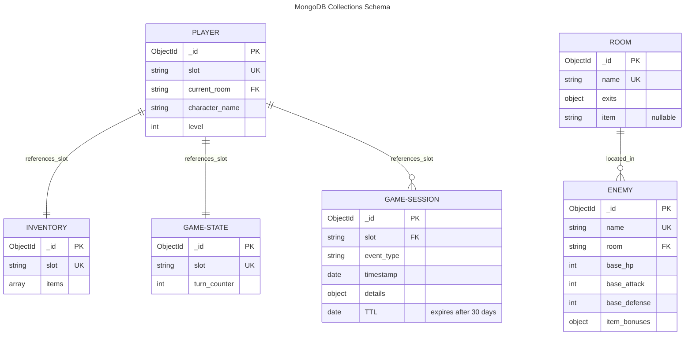

# CS-499 - Category One: Software Design and Engineering

This repository contains an enhanced version of a text-based adventure game originally built for IT-140. The project was refactored from a monolithic script into a modular, object-oriented architecture with MongoDB persistence, a lightweight API layer, and Docker support.

## Enhancement Summary

- Refactored procedural logic into classes and domain modules
- Introduced a centralized game engine
- Added improved command parsing, validation, and error handling
- Implemented configurable room and item management
- Added MongoDB-backed save/load functionality
- Added optional API mode for online interaction
- Added Docker and Docker Compose for containerized execution

## Category Two: Algorithms and Data Structures

This artifact now includes algorithm-focused enhancements beyond basic conditional logic:

- Game world represented as a graph using directional room edges
- Graph traversal with BFS shortest-path routing (`route <room>`)
- Command dispatch table with alias normalization for efficient parsing
- Inventory upgraded to dictionary/list hybrid for fast lookup and ordered display
- Deterministic stat-based combat calculations with item-driven modifiers
- Priority queue procedural event system for scalable dynamic encounters
- Scalable room and item lookup maps for future content expansion

## Category Three: Databases

This artifact now includes a database-driven persistence architecture in MongoDB:

- MongoDB integration with a repository abstraction layer
- Multi-collection schema for `players`, `inventory`, `rooms`, `game_state`, and `game_sessions`
- Additional `enemies` collection for enemy profiles and combat configuration
- Persistent save/load state with turn counter persistence
- Persistent inventory tracking through dedicated inventory documents
- Dynamic room loading from MongoDB with fallback seeding from defaults
- Session event logging for future analytics/multiplayer-oriented extensions
- TTL-based retention on session events for long-term storage control
- Docker-based MongoDB runtime support for local development

### Database Schema



**Indexes:**
- `players.slot` (unique)
- `inventory.slot` (unique)
- `rooms.name` (unique)
- `enemies.name` (unique)
- `game_state.slot` (unique)
- `game_sessions.timestamp` (TTL: 30 days)

## Project Structure

- `TextBasedGame.py` - legacy launcher that starts the new architecture
- `main.py` - application entrypoint (`cli` or `api` mode)
- `game/` - core game package containing orchestration, models, combat, traversal, and persistence
- `game/game_engine.py` - core orchestration and command processing
- `game/player.py` - player model
- `game/room.py` - room model and movement rules
- `game/inventory.py` - inventory model
- `game/combat.py` - encounter resolution
- `game/database.py` - MongoDB persistence layer
- `api.py` - Flask API endpoints
- `requirements.txt` - Python dependencies
- `Dockerfile` / `docker-compose.yml` - container setup

## Requirements

- Python 3.11+
- MongoDB (local instance or container)

## Running Tests

Install development dependencies:

```bash
pip install -r requirements-dev.txt
```

Run the test suite:

```bash
pytest
```

Current suite covers:

- world graph traversal and movement checks
- inventory dictionary/list behavior
- combat stat calculation outcomes
- event-priority queue behavior
- game command parsing and alias handling

### MongoDB Integration Tests

One test module requires a live MongoDB instance and is marked as `integration`.

Run only unit tests locally:

```bash
pytest -m "not integration"
```

Run integration tests locally with MongoDB available:

```bash
set MONGODB_URI=mongodb://localhost:27017
pytest -m integration
```

The GitHub Actions workflow starts a MongoDB service container automatically, so the full suite runs there.

## Continuous Integration (CI)

GitHub Actions workflow: `.github/workflows/ci.yml`

CI runs automatically on:

- push to `main` or `master`
- pull requests targeting `main` or `master`
- manual runs via `workflow_dispatch`

CI job behavior:

- tests on Python `3.11` and `3.12`
- installs dependencies from `requirements-dev.txt`
- runs `pytest -q`

## Local Run (CLI)

1. Install dependencies:

```bash
pip install -r requirements.txt
```

2. Set MongoDB URI (optional if using local default):

```bash
set MONGODB_URI=mongodb://localhost:27017
```

3. Run game:

```bash
python main.py --mode cli
```

You can also continue using:

```bash
python TextBasedGame.py
```

## API Run

```bash
python main.py --mode api --host 0.0.0.0 --port 8000
```

Then open the browser UI at:

```text
http://localhost:8000/
```

### API Endpoints

- `GET /health` - service health
- `GET /state` - current game state
- `POST /command` - execute command, JSON body: `{ "command": "go East" }`
- `POST /save/<slot>` - save to slot
- `GET /saves` - list save slots
- `POST /reset` - reset in-memory game state for a fresh run

## Browser UI

The web interface is served by Flask from `web/` and supports:

- movement buttons generated from current exits
- room item pickup with one click
- command console for advanced commands
- shortest-path routing (`route <room>`)
- save/load slot actions
- event log and live state refresh

Launch command:

```bash
python main.py --mode api --host 0.0.0.0 --port 8000
```

Open:

```text
http://localhost:8000/
```

## Docker Run

Run game and MongoDB together:

```bash
docker compose up --build
```

This starts:

- `mongodb` on port `27017`
- `game` container in CLI mode

### Docker Run (API Production Profile)

Build and run API + MongoDB with health checks:

```bash
docker compose -f docker-compose.api.yml up --build
```

This starts:

- `game-api` on port `8000`
- `mongodb` on port `27017`
- health checks for both services

## Environment Variables

Use `.env.example` as a template:

- `MONGODB_URI` - MongoDB connection string
- `HOST` - host binding in non-container API mode
- `PORT` - API port
- `LOG_LEVEL` - logging level (`DEBUG`, `INFO`, `WARNING`, etc.)

Example:

```bash
set MONGODB_URI=mongodb://localhost:27017
set LOG_LEVEL=INFO
python main.py --mode api --host 0.0.0.0 --port 8000
```

## Deployment Config

`render.yaml` is included for Render deployment using `Dockerfile.api`.

## Offline Distribution (.exe)

Build a Windows executable with PyInstaller:

```bash
build-exe.bat
```

or:

```bash
powershell -ExecutionPolicy Bypass -File scripts/build-exe.ps1
```

Output file:

- `dist/HauntedMansionEscape.exe`

### Save Data and Offline MongoDB Options

- Save/load relies on MongoDB via `MONGODB_URI`.
- If MongoDB is unavailable, gameplay still works but save/load is disabled.
- For offline save support on Windows, run a local MongoDB instance or use Docker Desktop with:

```bash
docker compose up -d mongodb
```

## Release Packaging Notes

For sharing the `.exe`:

- Include `HauntedMansionEscape.exe` from `dist/`.
- Include a short `README` section with required options:
	- no-save mode (works without MongoDB)
	- save-enabled mode (requires local MongoDB or Docker)
- If using Docker-based save support, provide this startup command:

```bash
docker compose up -d mongodb
```

## Core Commands In Game

- `go <North|South|East|West>`
- `get <item name>`
- `inventory`
- `route <room name>`
- `look`
- `save [slot]`
- `load [slot]`
- `saves`
- `help`
- `quit`

## Course Outcome Alignment

This enhancement demonstrates:

- object-oriented software design
- modular software engineering
- maintainability and separation of concerns
- persistence integration with MongoDB
- API integration fundamentals
- containerized deployment with Docker

## Deployment TODOs

- [ ] Network deployment (hosted access)
- [x] Build a production Docker image for API mode
- [ ] Move MongoDB to a managed/hosted instance and configure `MONGODB_URI`
- [x] Add deployment configuration for a target platform (for example: Render, Fly.io, or Azure)
- [x] Add health checks, environment variable docs, and basic production logging

- [ ] Offline distribution (Windows `.exe`)
- [x] Add a PyInstaller build script for CLI mode
- [ ] Verify the executable runs without a local Python install
- [x] Document save-data path and offline MongoDB requirement/options
- [x] Add release packaging notes for sharing the `.exe`
