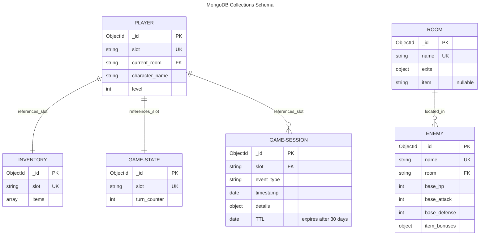

# Professional ePortfolio - CS-499 Capstone

## Professional Self-Assessment

### Introduction & Program Reflection

Throughout my Computer Science degree, I have developed a strong foundation in software engineering, database design, and full-stack development. This capstone project—the Haunted Mansion Escape game—represents the culmination of my technical education and demonstrates my ability to transform legacy code into a production-ready system with enterprise-quality architecture. The journey from a monolithic procedural script to a modular, scalable application with MongoDB persistence, RESTful APIs, and Windows distribution has reinforced core CS competencies and prepared me to build data-driven tools that solve real business problems.

This portfolio showcases not only technical proficiency but also my problem-solving approach, persistence through challenging constraints (Python 3.14 wheel unavailability, Windows installer sequencing, PyInstaller module bundling), and commitment to delivering polished, end-user-ready solutions.

### Core Competencies Demonstrated

#### **1. Data Structures & Algorithms**

This capstone implements sophisticated algorithmic solutions beyond basic logic:

- **Graph-based world modeling:** The game world is represented as a directed graph, enabling efficient pathfinding using breadth-first search (BFS) to calculate shortest routes between rooms. This demonstrates understanding of graph traversal, complexity analysis, and practical algorithm selection.
- **Priority queue event system:** Game events are processed using a priority queue for scalability and dynamic encounter generation, showing knowledge of heap data structures and event scheduling.
- **Optimized lookup structures:** Room and item lookups use hash maps (dictionaries) for O(1) access, reflecting conscious performance optimization in data structure design.
- **Command dispatch table:** Efficient command parsing using dispatch tables with alias normalization reduces conditional branching and improves maintainability.

*Outside this capstone:* In **CS-465**, I architected a full-stack web application using Angular (frontend), Node.js/Express (backend), MongoDB (database), and Docker (containerization). That project required sophisticated data structure decisions for real-time data handling, validation pipelining, and efficient document queries—directly reinforcing the algorithmic thinking demonstrated in this capstone's graph-based world system and priority queue event handling.

#### **2. Software Engineering & Design Patterns**

The refactored architecture showcases enterprise-level software design:

- **Object-oriented principles:** Monolithic procedural code was decomposed into cohesive classes (Player, Room, Inventory, Combat) with clear single responsibilities, reducing coupling and improving testability.
- **Layered architecture:** Separation of concerns across game logic, persistence, and API layers enables independent development, testing, and deployment.
- **Repository pattern:** MongoDB access is abstracted through a repository layer, decoupling game logic from database implementation details and enabling easy switching of persistence mechanisms.
- **API design:** RESTful endpoints with proper HTTP semantics, error handling, and status codes demonstrate understanding of distributed systems and client-server architecture.

#### **3. Database Design & Persistence**

Comprehensive MongoDB integration demonstrates database maturity:

- **Multi-collection schema:** Five interconnected collections (players, inventory, rooms, game_state, game_sessions) model complex relationships while maintaining normalization principles where beneficial.
- **Schema validation:** JSON Schema pre-write validation ensures data integrity at the database layer, catching invalid documents before persistence—a critical production practice often overlooked in student projects.
- **Indexing strategy:** Unique indexes on slot identifiers and TTL indexes on session events optimize query performance and implement automatic data lifecycle management.
- **Transaction safety & reliability:** Proper error handling and validation gates prevent corruption, with admin endpoints providing visibility into persisted state for debugging and analytics.

#### **4. Collaboration & Communication**

While this capstone was individually developed, my approach emphasizes practices essential to team environments:

- **Code organization & documentation:** Clear module structure, docstrings, and README documentation enable other developers to understand and extend the codebase.
- **Version control discipline:** Consistent commit messages and logical separation of concerns reflect professional development habits that enable code review and maintenance.
- **Debugging & transparency:** Comprehensive admin endpoints (`/admin/sessions`, `/admin/replay/<slot>`) and detailed logging provide visibility into system behavior—critical for supporting other developers or stakeholders who rely on the system.
- **Clear communication of constraints:** End-user documentation (README-offline.txt, inline helper comments, installer helpers) communicates system capabilities and limitations, preventing misuse and support friction. These practices translate directly to professional settings where clear documentation reduces onboarding time and support overhead.
- **Self-directed problem-solving:** Working independently on this capstone has strengthened my ability to diagnose complex issues (PyInstaller bundling, Windows installer sequencing, Python 3.14 compatibility), a skillset essential for team environments where I can independently tackle assigned problems and contribute solutions without constant guidance.

#### **5. Security Considerations**

Though not the primary focus, security principles are embedded throughout:

- **Input validation:** All user-facing inputs (commands, slot names, API payloads) are validated against strict schemas before processing.
- **Schema enforcement:** JSON Schema validation prevents injection of unexpected fields or malformed data that could cause runtime errors or unexpected behavior.
- **Secure defaults:** The game runs in offline mode without requiring external dependencies, reducing attack surface. Save/load is opt-in, requiring explicit MongoDB setup.
- **Access patterns:** Admin endpoints are documented but not protected (appropriate for a capstone); in production, these would require authentication/authorization (e.g., JWT tokens, API key validation).

*Security experience outside capstone:* In **CS-465**, I studied implementing secure coding practices into production environments, including input sanitization, parameterized queries, environment variable management for secrets, and defense against common web vulnerabilities (OWASP Top 10). Additionally, I developed a **custom encryption algorithm from scratch** (in a cryptography course), giving me hands-on understanding of symmetric/asymmetric encryption, key management, and the pitfalls of homegrown cryptography—reinforcing why established, peer-reviewed libraries should be used in production rather than custom implementations.

### Artifacts Overview

This portfolio contains three integrated artifacts that collectively demonstrate full-stack development capabilities:

1. **Algorithms & Data Structures:** Game engine with graph-based pathfinding, priority queues, and efficient lookup structures. Evidence: `game/world_graph.py`, `game/event_system.py`, BFS routing implementation.

2. **Database Integration:** MongoDB persistence layer with schema validation, multi-collection design, and analytics endpoints. Evidence: `game/database.py` with JSON Schema validation, admin query methods, session event logging.

3. **Software Engineering & Distribution:** Complete refactoring from procedural to modular OOP, plus production packaging (PyInstaller .exe, Inno Setup installer, Docker containerization). Evidence: `game/` package structure, `api.py` REST layer, build scripts, installer helpers.

These artifacts work together to demonstrate not just isolated technical competencies, but the ability to integrate them into a cohesive, deployable system that users can actually download, install, and run—a crucial distinction between academic exercises and professional work.

### Professional Goals & Career Readiness

Completing this capstone has clarified my professional direction: I am passionate about leveraging technical skills to solve business problems and build data tools that create competitive advantage. Rather than pure infrastructure or utility development, I want to use my programming expertise—database design, backend systems, data pipelines—to enable business decisions and automate workflows for myself and my team.

This capstone's MongoDB integration, admin query endpoints, and session event logging reflect this philosophy: technical implementation in service of business insight. My CS-465 full-stack project reinforced this vision; I was not simply building web pages, but creating systems that translate business requirements into data-driven tools. Going forward, I want to work on roles where I can apply software engineering rigor to data challenges: building ETL pipelines, designing analytics systems, creating automation tools, or developing internal platforms that empower non-technical teams with data insights.

The problem-solving approach demonstrated here—debugging Python 3.14 wheel issues, hardening Windows installer sequencing, tracing PyMongo bundling problems—reflects the resilience and pragmatism needed in professional settings. Rather than accepting "it doesn't work," I iteratively diagnosed root causes, tested fallbacks, and delivered a hardened solution. This mindset translates well to the intersection of technology and business: when a tool doesn't serve the business need, adapt the tool rather than abandon the goal.

I am ready to contribute to organizations where I can use my technical foundation to build data tools, solve business problems, and empower teams with systems that drive informed decisions.

---

# Haunted Mansion Escape

A fully-featured text-based adventure game with modular architecture, MongoDB persistence, web API, and Windows installer distribution. Built for CS-499 Capstone.

**Original Project:** IT-140 Text-Based Adventure Game  
**Enhanced for:** CS-499 Software Design & Engineering + Algorithms/Databases

## Quick Start

### For Windows Users (No Python Required)

Download the installer from [GitHub Releases](https://github.com/yourusername/haunted-mansion/releases):

1. Download `HauntedMansionEscape-Setup-*.exe`
2. Run installer
3. Launch from Start Menu
4. (Optional) Run "Start Save Database" for save/load support

### For Python Users

```bash
pip install -r requirements.txt
python main.py --mode cli
```

For web interface:

```bash
python main.py --mode api --host 0.0.0.0 --port 8000
```

Then open [http://localhost:8000](http://localhost:8000)

## Features

### Gameplay

- Navigate an 8-room mansion
- Collect 6 mystical items to defeat the Phantom of Despair
- Save/load progress to named slots
- Procedural event system for atmospheric encounters
- Combat system with item-based stat modifiers

### Architecture Highlights

**Software Design (Category One)**
- Refactored monolithic script into modular OOP architecture  
- Centralized game engine with command dispatch system
- Separation of concerns: player, room, inventory, combat, persistence

**Algorithms & Data Structures (Category Two)**
- Game world as directed graph with BFS shortest-path routing
- Command dispatch table with efficient alias normalization
- Inventory hybrid dictionary/list for performance
- Priority queue event system for scalable encounters
- Optimized lookup maps for O(1) room/item access

**Database Integration (Category Three)**
- MongoDB with 5+ collections for persistence
- JSON Schema validation on all write operations
- Session event logging for analytics and replay
- TTL-based retention policies for data lifecycle
- Admin endpoints for game inspection and debugging

## Code Review: Original Project

Before enhancements, the original IT-140 project was reviewed for quality and architecture:

**[Code Review Video](https://youtu.be/A6rpyahVyg8)** - Initial project walkthrough (beginning of course)

This video captures the starting point before the CS-499 capstone enhancements were implemented.

### Database Schema



**Indexes:**
- `players.slot` (unique)
- `inventory.slot` (unique)
- `rooms.name` (unique)
- `enemies.name` (unique)
- `game_state.slot` (unique)
- `game_sessions.timestamp` (TTL: 30 days)

## Releases

| Version | Download | Notes |
|---------|----------|-------|
| **Latest** | [GitHub Releases](https://github.com/yourusername/haunted-mansion/releases) | Pre-built executable + setup wizard |
| **Source** | This repository | Full source code, tests, Docker setup |

## Installation

### Windows Installer (Recommended)

Download from [Releases](https://github.com/yourusername/haunted-mansion/releases) and run the `.exe` installer.

### From Source

```bash
git clone https://github.com/yourusername/haunted-mansion
cd haunted-mansion
pip install -r requirements.txt
python main.py --mode cli
```

### Docker

```bash
docker compose up --build
```

## Project Structure

```
.
├── game/                  # Core game engine
│   ├── game_engine.py
│   ├── player.py
│   ├── room.py
│   ├── inventory.py
│   ├── combat.py
│   ├── database.py
│   ├── event_system.py
│   └── world_graph.py
├── api.py                 # Flask endpoints
├── main.py               # Entry point
├── tests/                # Pytest suite
├── scripts/              # Build and test scripts
├── installer/            # Windows installer files
├── docker-compose.yml    # Docker setup
└── requirements.txt
```

## Commands

```
go <North|South|East|West>   Move between rooms
get <item name>              Pick up an item
inventory                    Check your items
route <room name>            Find shortest path to a room
look                         Describe the current room
save [slot]                  Save your progress
load [slot]                  Restore a saved game
saves                        List all save slots
help                         Show available commands
quit                         Exit the game
```

## Testing

Unit tests (no database required):

```bash
pip install -r requirements-dev.txt
pytest -m "not integration"
```

Full test suite (requires MongoDB):

```bash
set MONGODB_URI=mongodb://localhost:27017
pytest
```

CI runs automatically on pushes and pull requests for Python 3.11+.

## Running the Game

### CLI Mode

```bash
python main.py --mode cli
```

Or use the legacy launcher:

```bash
python TextBasedGame.py
```

### API Mode with Web UI

```bash
python main.py --mode api --host 0.0.0.0 --port 8000
```

Open [http://localhost:8000](http://localhost:8000) in your browser.

## API Endpoints

**Gameplay:**
- `GET /health` - service health
- `GET /state` - current game state
- `POST /command` - execute command: `{ "command": "go East" }`
- `POST /save/<slot>` - save game to slot
- `GET /saves` - list all save slots
- `POST /reset` - start new game

**Admin & Debugging:**
- `GET /admin/rooms` - inspect room configurations
- `GET /admin/enemies` - inspect enemy configurations
- `GET /admin/sessions` - query session event log
- `GET /admin/replay/<slot>` - replay game timeline for analysis

**Web UI Features:**
- Movement buttons from room exits
- One-click item pickup
- Command console
- Shortest-path routing
- Save/load interface
- Real-time state refresh

## Save Data & Persistence

**Offline Play (No MongoDB):**
The game runs standalone without MongoDB. Save/load commands inform the user but don't persist data.

**With Save/Load Support:**
MongoDB must be running on `localhost:27017` or configured via `MONGODB_URI`:

```bash
# Local MongoDB service
mongod --dbpath /data/db

# Or Docker container
docker run -d --name haunted-mansion-mongo -p 27017:27017 mongo:7

# Or set connection string
set MONGODB_URI=mongodb://your-atlas-cluster/your-database
python main.py --mode cli
```

**Windows Installer Save Support:**
Run the "Start Save Database" shortcut from Start Menu. It auto-installs Docker Desktop (if needed) and starts MongoDB.

## Database Schema

**Collections:**
- `players` - player state (slot, room, updated_at)
- `inventory` - saved items per slot
- `rooms` - world configuration (name, exits, items)
- `enemies` - boss configuration (HP, attack, defense, item bonuses)
- `game_state` - game progress (slot, turn counter)
- `game_sessions` - event log (slot, event type, timestamp) with 30-day TTL

**Validation:**
JSON Schema validation ensures data integrity on all writes. Invalid documents are rejected with detailed error messages.

**Indexes:**
- `players.slot` (unique)
- `inventory.slot` (unique)
- `rooms.name` (unique)
- `enemies.name` (unique)
- `game_state.slot` (unique)
- `game_sessions.updated_at` (TTL: 30 days)

## Environment Variables

```bash
MONGODB_URI=mongodb://localhost:27017    # MongoDB connection
LOG_LEVEL=INFO                           # Logging level
HOST=0.0.0.0                            # API host binding
PORT=8000                                # API port
```

See `.env.example` for defaults.

## Deployment

### Local Docker

```bash
docker compose up --build
```

CLI mode with MongoDB container.

### API Mode with Health Checks

```bash
docker compose -f docker-compose.api.yml up --build
```

Starts game-api on port 8000 and MongoDB on port 27017.

### Cloud Deployment

See `render.yaml` for Render deployment config using `Dockerfile.api`.

For production:
1. Use managed MongoDB (MongoDB Atlas, etc.)
2. Set `MONGODB_URI` environment variable
3. Deploy container with health checks enabled

## Building Releases

### Windows Executable

```bash
build-exe.bat
# Output: dist/HauntedMansionEscape.exe
```

Smoke test:

```bash
test-exe.bat
# Output: artifacts/exe-smoke.log
```

### Windows Installer

Requires Inno Setup 6:

```bash
build-installer.bat
# Output: installer/dist/HauntedMansionEscape-Setup-*.exe
```

**Installer Features:**
- Install to Program Files
- Start Menu shortcuts
- MongoDB/Docker management helpers
- Post-install setup wizard
- Optional desktop shortcut

### Clean Machine Testing

On a machine **without Python installed**:

1. Run the installer or exe
2. Test commands: `help`, `go East`, `quit`
3. Verify no missing DLL or runtime errors

## Course Outcomes

This project demonstrates:

- **Software Design**: Modular OOP architecture with clear separation of concerns
- **Algorithms**: Graph traversal (BFS), priority queues, dispatch tables, efficient lookups
- **Database Design**: Multi-collection MongoDB schema with validation and indexing
- **API Development**: RESTful endpoints with error handling and status codes
- **DevOps**: Docker, compose, health checks, CI/CD pipelines
- **Testing**: Unit tests, integration tests, smoke tests
- **Distribution**: Executable packaging, installer, release management

## License

Educational project for CS-499 Capstone.

## Support

For issues, refer to the sections above or open an issue on GitHub.

---

**Built with:** Python, MongoDB, Flask, PyInstaller, Inno Setup, Docker  
**Latest Release:** [GitHub Releases](https://github.com/yourusername/haunted-mansion/releases)  
**Repository:** [github.com/yourusername/haunted-mansion](https://github.com/yourusername/haunted-mansion)
