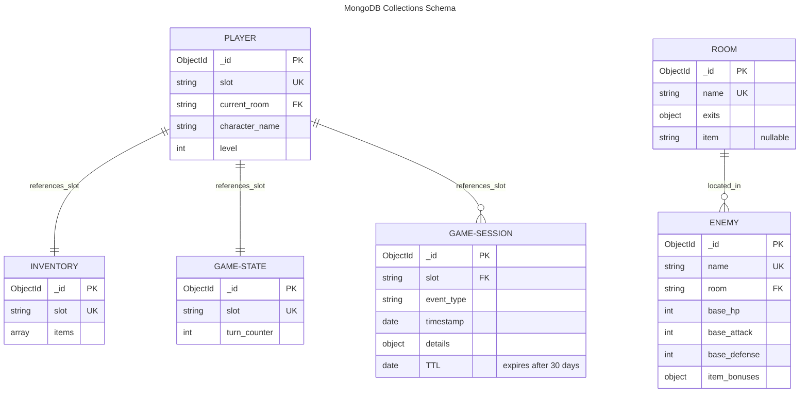

# Haunted Mansion Escape

A fully-featured text-based adventure game with modular architecture, MongoDB persistence, web API, and Windows installer distribution. Built for CS-499 Capstone.

**Original Project:** IT-140 Text-Based Adventure Game  
**Enhanced for:** CS-499 Software Design & Engineering + Algorithms/Databases

## Quick Start

### For Windows Users (No Python Required)

Download the installer from [GitHub Releases](https://github.com/yourusername/haunted-mansion/releases):

1. Download `HauntedMansionEscape-Setup-*.exe`
2. Run installer
3. Launch from Start Menu
4. (Optional) Run "Start Save Database" for save/load support

### For Python Users

```bash
pip install -r requirements.txt
python main.py --mode cli
```

For web interface:

```bash
python main.py --mode api --host 0.0.0.0 --port 8000
```

Then open [http://localhost:8000](http://localhost:8000)

## Features

### Gameplay

- Navigate an 8-room mansion
- Collect 6 mystical items to defeat the Phantom of Despair
- Save/load progress to named slots
- Procedural event system for atmospheric encounters
- Combat system with item-based stat modifiers

### Architecture Highlights

**Software Design (Category One)**
- Refactored monolithic script into modular OOP architecture  
- Centralized game engine with command dispatch system
- Separation of concerns: player, room, inventory, combat, persistence

**Algorithms & Data Structures (Category Two)**
- Game world as directed graph with BFS shortest-path routing
- Command dispatch table with efficient alias normalization
- Inventory hybrid dictionary/list for performance
- Priority queue event system for scalable encounters
- Optimized lookup maps for O(1) room/item access

**Database Integration (Category Three)**
- MongoDB with 5+ collections for persistence
- JSON Schema validation on all write operations
- Session event logging for analytics and replay
- TTL-based retention policies for data lifecycle
- Admin endpoints for game inspection and debugging


### Database Schema



**Indexes:**
- `players.slot` (unique)
- `inventory.slot` (unique)
- `rooms.name` (unique)
- `enemies.name` (unique)
- `game_state.slot` (unique)
- `game_sessions.timestamp` (TTL: 30 days)

## Releases

| Version | Download | Notes |
|---------|----------|-------|
| **Latest** | [GitHub Releases](https://github.com/yourusername/haunted-mansion/releases) | Pre-built executable + setup wizard |
| **Source** | This repository | Full source code, tests, Docker setup |

## Installation

### Windows Installer (Recommended)

Download from [Releases](https://github.com/yourusername/haunted-mansion/releases) and run the `.exe` installer.

### From Source

```bash
git clone https://github.com/yourusername/haunted-mansion
cd haunted-mansion
pip install -r requirements.txt
python main.py --mode cli
```

### Docker

```bash
docker compose up --build
```

## Project Structure

```
.
├── game/                  # Core game engine
│   ├── game_engine.py
│   ├── player.py
│   ├── room.py
│   ├── inventory.py
│   ├── combat.py
│   ├── database.py
│   ├── event_system.py
│   └── world_graph.py
├── api.py                 # Flask endpoints
├── main.py               # Entry point
├── tests/                # Pytest suite
├── scripts/              # Build and test scripts
├── installer/            # Windows installer files
├── docker-compose.yml    # Docker setup
└── requirements.txt
```

## Commands

```
go <North|South|East|West>   Move between rooms
get <item name>              Pick up an item
inventory                    Check your items
route <room name>            Find shortest path to a room
look                         Describe the current room
save [slot]                  Save your progress
load [slot]                  Restore a saved game
saves                        List all save slots
help                         Show available commands
quit                         Exit the game
```

## Testing

Unit tests (no database required):

```bash
pip install -r requirements-dev.txt
pytest -m "not integration"
```

Full test suite (requires MongoDB):

```bash
set MONGODB_URI=mongodb://localhost:27017
pytest
```

CI runs automatically on pushes and pull requests for Python 3.11+.

## Running the Game

### CLI Mode

```bash
python main.py --mode cli
```

Or use the legacy launcher:

```bash
python TextBasedGame.py
```

### API Mode with Web UI

```bash
python main.py --mode api --host 0.0.0.0 --port 8000
```

Open [http://localhost:8000](http://localhost:8000) in your browser.

## API Endpoints

**Gameplay:**
- `GET /health` - service health
- `GET /state` - current game state
- `POST /command` - execute command: `{ "command": "go East" }`
- `POST /save/<slot>` - save game to slot
- `GET /saves` - list all save slots
- `POST /reset` - start new game

**Admin & Debugging:**
- `GET /admin/rooms` - inspect room configurations
- `GET /admin/enemies` - inspect enemy configurations
- `GET /admin/sessions` - query session event log
- `GET /admin/replay/<slot>` - replay game timeline for analysis

**Web UI Features:**
- Movement buttons from room exits
- One-click item pickup
- Command console
- Shortest-path routing
- Save/load interface
- Real-time state refresh

## Save Data & Persistence

**Offline Play (No MongoDB):**
The game runs standalone without MongoDB. Save/load commands inform the user but don't persist data.

**With Save/Load Support:**
MongoDB must be running on `localhost:27017` or configured via `MONGODB_URI`:

```bash
# Local MongoDB service
mongod --dbpath /data/db

# Or Docker container
docker run -d --name haunted-mansion-mongo -p 27017:27017 mongo:7

# Or set connection string
set MONGODB_URI=mongodb://your-atlas-cluster/your-database
python main.py --mode cli
```

**Windows Installer Save Support:**
Run the "Start Save Database" shortcut from Start Menu. It auto-installs Docker Desktop (if needed) and starts MongoDB.

## Database Schema

**Collections:**
- `players` - player state (slot, room, updated_at)
- `inventory` - saved items per slot
- `rooms` - world configuration (name, exits, items)
- `enemies` - boss configuration (HP, attack, defense, item bonuses)
- `game_state` - game progress (slot, turn counter)
- `game_sessions` - event log (slot, event type, timestamp) with 30-day TTL

**Validation:**
JSON Schema validation ensures data integrity on all writes. Invalid documents are rejected with detailed error messages.

**Indexes:**
- `players.slot` (unique)
- `inventory.slot` (unique)
- `rooms.name` (unique)
- `enemies.name` (unique)
- `game_state.slot` (unique)
- `game_sessions.updated_at` (TTL: 30 days)

## Environment Variables

```bash
MONGODB_URI=mongodb://localhost:27017    # MongoDB connection
LOG_LEVEL=INFO                           # Logging level
HOST=0.0.0.0                            # API host binding
PORT=8000                                # API port
```

See `.env.example` for defaults.

## Deployment

### Local Docker

```bash
docker compose up --build
```

CLI mode with MongoDB container.

### API Mode with Health Checks

```bash
docker compose -f docker-compose.api.yml up --build
```

Starts game-api on port 8000 and MongoDB on port 27017.

### Cloud Deployment

See `render.yaml` for Render deployment config using `Dockerfile.api`.

For production:
1. Use managed MongoDB (MongoDB Atlas, etc.)
2. Set `MONGODB_URI` environment variable
3. Deploy container with health checks enabled

## Building Releases

### Windows Executable

```bash
build-exe.bat
# Output: dist/HauntedMansionEscape.exe
```

Smoke test:

```bash
test-exe.bat
# Output: artifacts/exe-smoke.log
```

### Windows Installer

Requires Inno Setup 6:

```bash
build-installer.bat
# Output: installer/dist/HauntedMansionEscape-Setup-*.exe
```

**Installer Features:**
- Install to Program Files
- Start Menu shortcuts
- MongoDB/Docker management helpers
- Post-install setup wizard
- Optional desktop shortcut

### Clean Machine Testing

On a machine **without Python installed**:

1. Run the installer or exe
2. Test commands: `help`, `go East`, `quit`
3. Verify no missing DLL or runtime errors

## Course Outcomes

This project demonstrates:

- **Software Design**: Modular OOP architecture with clear separation of concerns
- **Algorithms**: Graph traversal (BFS), priority queues, dispatch tables, efficient lookups
- **Database Design**: Multi-collection MongoDB schema with validation and indexing
- **API Development**: RESTful endpoints with error handling and status codes
- **DevOps**: Docker, compose, health checks, CI/CD pipelines
- **Testing**: Unit tests, integration tests, smoke tests
- **Distribution**: Executable packaging, installer, release management

## License

Educational project for CS-499 Capstone.

## Support

For issues, refer to the sections above or open an issue on GitHub.

---

**Built with:** Python, MongoDB, Flask, PyInstaller, Inno Setup, Docker  
**Latest Release:** [GitHub Releases](https://github.com/yourusername/haunted-mansion/releases)  
**Repository:** [github.com/yourusername/haunted-mansion](https://github.com/yourusername/haunted-mansion)
